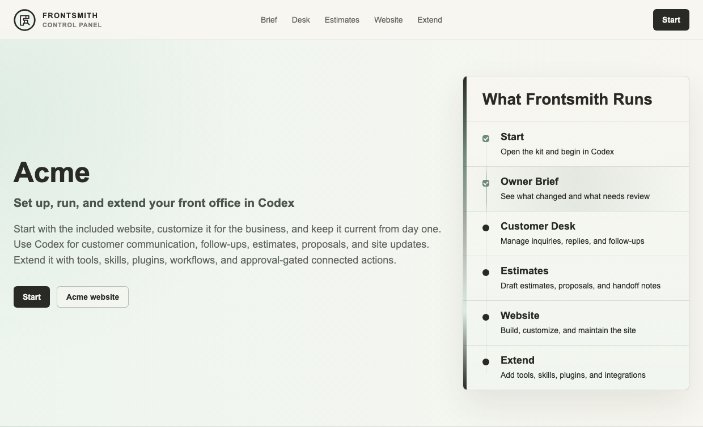
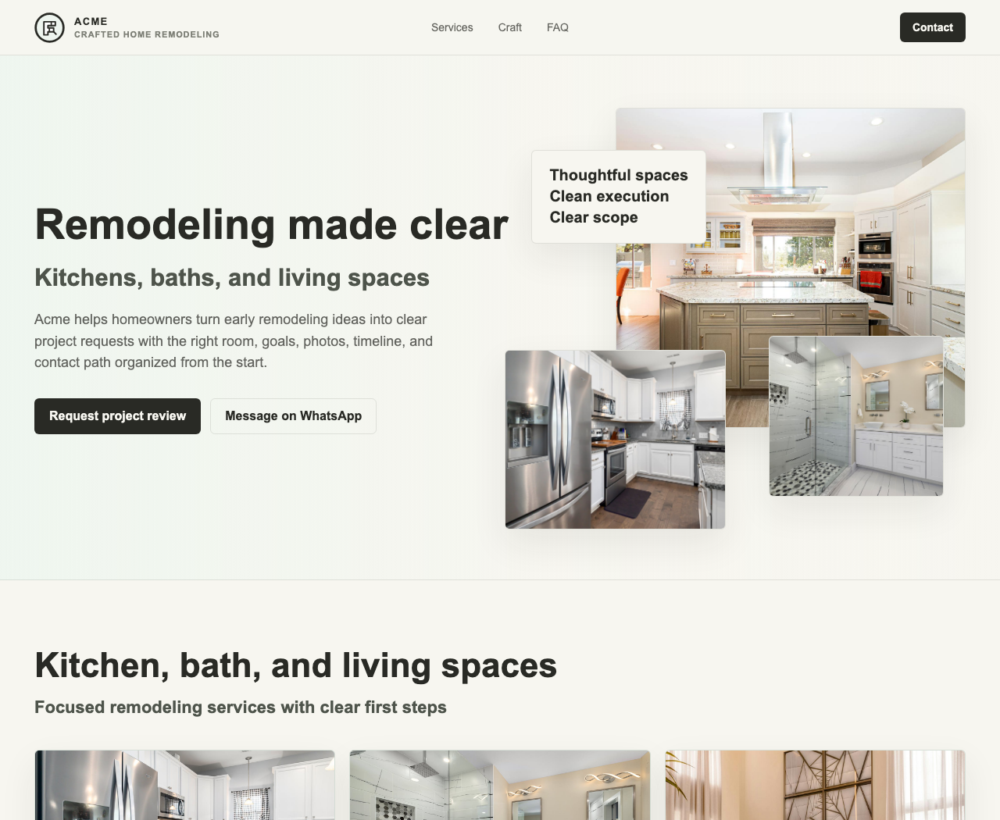

# Frontsmith

Frontsmith v1.0 is an open-source Codex-native front-office kit for local service businesses.

It gives an operator a single Codex-ready workspace to set up a local service business once, then keep operating the digital front office: ongoing customer inquiries, reply drafts, follow-ups, estimates, proposals, website updates, launch checks, activity history, and approval-gated connections.

The operator works through Codex: update the business details, review the Owner Brief, prepare customer replies and estimates, inspect the website and customer-facing drafts, approve what is ready, and keep improving the front office as the business changes.

Frontsmith's primary interface is chat-driven inside Codex, backed by repo files and local scripts. The expected loop is:

```text
owner prompt in Codex
  -> Frontsmith reads local business records
  -> Codex returns a formatted brief, draft, plan, or checklist
  -> owner reviews the generated artifact
  -> approved changes update files, website content, or connected action drafts
```

## Preview

Hosted evaluator Control Panel:



Included Acme website:



## Product Shape

```text
GitHub repo
  -> open in Codex
  -> set up the business workspace
  -> operate customer communications
  -> review the Owner Brief
  -> customize the included website
  -> prepare estimates and proposals
  -> preview locally
  -> review the hosted Control Panel when needed
  -> connect integrations when approved
  -> deploy the approved website
  -> keep operating through Codex workflows
```

Frontsmith keeps operating data separate from the public website: use `.frontsmith/business/` for private business records and `website/` for the launchable site.

The `frontsmith.neurapath.ai` target opens as a hosted Frontsmith Control Panel for Acme. It includes the Acme website at `/website` as the customer-facing site inside the wider front-office flow.

The hosted Control Panel is an evaluator preview of the Codex-native workflow, not the operating interface itself. It helps a cold visitor understand what they will actually see in Codex: prompts, Frontsmith responses, generated Markdown artifacts, local file updates, previews, and owner approval before live action.

## Out Of The Box

Frontsmith v1.0 includes the essential digital front office for a local service business:

- Business Setup
- Owner Brief
- Website
- Customer Desk
- Ongoing customer communication
- Estimates and Proposals
- Activity Log
- Settings and Integrations
- Extension Planning

## Quick Start

Open this repository in Codex and start with:

```text
Set up Frontsmith for my local service business.
```

Codex will set up a local business workspace, prepare the Owner Brief, update the included website, and start the ongoing front-office loop: customer reply drafts, follow-up notes, estimate and proposal drafts, launch checks, and approval-gated connection steps for publishing, email, file storage, and scheduling tools.

The Owner Brief is Frontsmith's current-state view for one business. It summarizes what changed, what is waiting, what is blocked, what needs approval, and what the owner should do next.

The Customer Desk is the ongoing communication lane. It keeps customer requests, reply drafts, follow-up notes, estimate next steps, and owner approvals together after the website is launched.

Connection and deployment steps stay approval-gated. Frontsmith prepares the path; it does not connect accounts, publish the site, or send customer messages without explicit owner approval.

Frontsmith already includes the launchable website here:

```text
website/
```

This is a static website folder, not a Next.js app. `website/` is the business website source: HTML, CSS, JavaScript, favicon files, logo files, and any future local image assets belong there.

During setup, Codex applies the business name, website URL, core services, contact details, branding, images, and search/social metadata to that single-page website. Changing the business name updates the business profile and website content; the website folder stays stable.

The default photos currently come from the business profile's `media` URLs. A business can replace them with local files under `website/assets/` and point the media fields to `/assets/...` paths.

The hosted Frontsmith Control Panel uses `demo/` as its entry point and copies `website/` into the built demo at `/website`.

## Developer Commands

Operators can let Codex run the commands. Developers can run them directly:

```bash
npm run check
npm run bootstrap -- --business-name "Acme" --website-url "https://acme.com"
npm run owner:brief
npm run prepare:reply -- --name "Customer" --project "Kitchen Remodeling" --notes "Customer wants help planning the next step."
npm run prepare:estimate -- --project "Kitchen Remodeling" --scope "Cabinets, counters, lighting, and layout clarification."
npm run prepare:extension -- --capability "Consultation scheduling" --connector "Google Calendar" --goal "Prepare an owner-reviewed workflow for approved consultation requests."
npm run update:website
npm run launch:status
npm run build:demo
npm run preview:demo
npm run deploy:check
npm run preview:website
```

The root `vercel.json` keeps Vercel in static-site mode and builds the hosted Frontsmith Control Panel into `dist/frontsmith-demo`. Frontsmith does not require `next.config`, `src/app`, or a Next.js build for the hosted target.

`npm run deploy:check` is a preflight gate, not a deployment command. It verifies the demo build, included website, Vercel static-site configuration, clean URLs, SEO/social metadata, icons, referenced assets, contact form API wiring, and required production email-delivery environment variables. It exits with blockers until the Resend and contact variables are configured, and it never sends email or deploys the site.

## Contact Form Delivery

The website contact form posts to:

```text
/api/contact
```

That server-side function sends the project request through Resend when delivery is configured. Browser JavaScript handles validation and the success state, but the email provider key stays in Vercel environment variables and is never exposed to the public website.

The default ownership model is business-owned email delivery: each business uses its own Resend account, verified sending domain, API key, and Vercel environment variables. NeuraPath-managed delivery can be offered later as a managed setup tier, but it is not the open-source default.

Required production variables:

```text
CONTACT_DELIVERY_MODE=resend
CONTACT_TO_EMAIL=projects@acme.com
CONTACT_FROM_EMAIL="Acme <hello@acme.com>"
CONTACT_SUBJECT_PREFIX=Website project request
FRONTSMITH_TENANT_ID=acme
RESEND_API_KEY=re_xxxxxxxxx
```

If `/api/contact` is not configured, the browser falls back to a prefilled email draft through the business email address.

Useful daily front-office commands:

```bash
npm run prepare:reply -- --name "Customer" --project "Kitchen Remodeling" --notes "Customer wants help planning the next step."
npm run prepare:estimate -- --project "Kitchen Remodeling" --scope "Cabinets, counters, lighting, and layout clarification."
npm run prepare:extension -- --capability "Consultation scheduling" --connector "Google Calendar" --goal "Prepare an owner-reviewed workflow for approved consultation requests."
npm run owner:brief
npm run deploy:check
npm test
```

## Repository Map

```text
Operator path
  docs/operator/start-here.md          first-run guidance for business operators
  workflows/                           Codex runbooks for setup, website, replies, estimates, and launch
  .frontsmith/business/                local business workspace created on first run, gitignored
  Owner Brief                          current-state summary prepared from local records
  website/                             launchable website that gets customized and deployed
  demo/                                hosted Frontsmith Control Panel for frontsmith.neurapath.ai

Product and development
  AGENTS.md                            Codex operating rules for this repository
  frontsmith.config.json               v1.0 kit configuration
  blueprints/local-service/            default local service business blueprint
  docs/product/architecture.md         product architecture and data flow
  docs/product/package-spec.md         v1.0 package scope
  docs/developer/extension-guide.md    extension guidance for developers
  DEVELOPERS.md                        developer rules
  scripts/                             local bootstrap, website updates, front-office tools, extension plans, preview, demo build, and checks
  tests/                               launch readiness and regression tests for the promised workflows
  docs/assets/                         README screenshots
  packages/core/                       shared business workspace model
  packages/adapters/                   integration adapter boundary
  packages/neura/                      governed-action boundary
```

## Safety Boundary

Frontsmith prepares, drafts, previews, and exports by default.

It does not silently send emails, publish websites, change DNS, contact customers, submit provider updates, or execute customer-facing actions. Consequential actions require explicit owner approval. In connected client mode, those actions should pass through Neura Registry and Neura Relay before execution.

## Project Resources

- [Changelog](CHANGELOG.md)
- [Contributing](CONTRIBUTING.md)
- [Support](SUPPORT.md)
- [Security policy](SECURITY.md)
